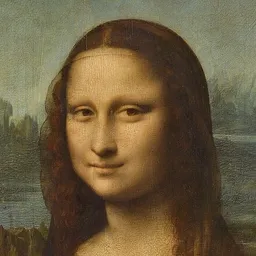
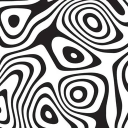

<!--
---
title: VGG19 Style Transfer
emoji: 🎨
colorFrom: blue
colorTo: indigo
sdk: gradio
sdk_version: 6.9.0
app_file: app.py
python_version: 3.12
pinned: false
---
-->

# VGG19 Style Transfer

An interactive neural style transfer demo built on a frozen VGG19 feature extractor. The project refactors the final implementation from `notebooks/experiments.ipynb` into a small Gradio application that supports sample images, custom uploads, progressive intermediate outputs, and start/stop control for long-running optimization.

## Example

<p align="center">
  
  <strong style="font-size: 28px; padding: 0 12px;">+</strong>
  
  <strong style="font-size: 28px; padding: 0 12px;">=</strong>
  
</p>

## Features

- VGG19-based optimization style transfer
- Progressive intermediate snapshots during generation
- Sample content and style image selection from `data/`
- Custom content and style uploads
- Runtime tracking and stop control in the UI
- Hugging Face Spaces-ready entrypoint

## Method

The backend follows the notebook implementation closely:

- VGG19 is used as a frozen feature extractor
- style loss is computed from Gram matrices of selected feature maps
- content loss is computed from selected content features
- LBFGS performs the image optimization
- intermediate states are streamed to the frontend during optimization

## Sample Assets

Content samples are loaded from `data/content/`:

- `cat.jpg`
- `face.jpg`
- `mona_lisa.jpg`

Style samples are loaded from `data/style/`:

- `abstract.jpg`
- `spiral.jpg`
- `starry_night.jpg`
- `tiles.jpg`

Any additional supported image files added to those folders will appear automatically in the app.

## Local Development

Install dependencies:

```bash
uv sync
```

Run the app locally:

```bash
uv run python -m src.main
```

You can also run the Hugging Face Spaces entrypoint directly:

```bash
uv run python app.py
```

## Hugging Face Spaces

This repository is configured for a Gradio Space:

- `README.md` includes the required Spaces YAML metadata
- `app.py` is the Spaces entrypoint
- `requirements.txt` contains minimal runtime dependencies

To deploy:

1. Create a new Hugging Face Space using the `Gradio` SDK.
2. Push this repository to the Space.
3. Hugging Face will install dependencies from `requirements.txt` and launch `app.py`.

## Repository Layout

- `app.py`: Hugging Face Spaces entrypoint
- `requirements.txt`: minimal deployment dependencies
- `src/image_utils.py`: image preprocessing and tensor/PIL conversion
- `src/losses.py`: style and content loss modules
- `src/model.py`: VGG19 runtime and feature extraction
- `src/transfer.py`: optimization loop and streamed updates
- `src/main.py`: Gradio UI and app state management
- `notebooks/experiments.ipynb`: original notebook implementation

## Notes

- Images are center-cropped and resized to `256x256` for a consistent interactive demo.
- CPU-only hosting works, but optimization-based style transfer is significantly faster on GPU-backed infrastructure.
